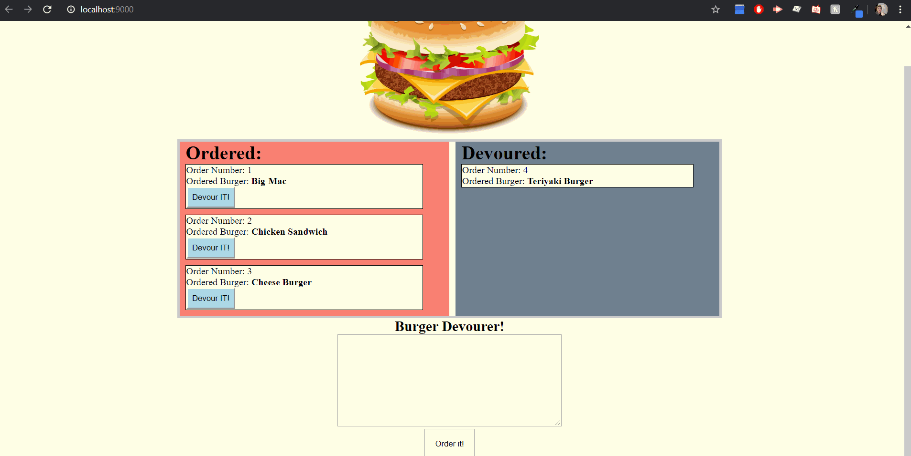

# Burger

<a href = "?"><strong>Heroku</strong></a> Deployed application. 
<a href = "https://github.com/Ericcwong/burger"><strong>GitHub</strong></a> Repository

Burger is an application that users can use to store what burger they ordered in the order section. When they choose to devour it, the burger that is clicked on is move to the devoured section.

# Getting Started
To get started, you can use this application through two different ways.

<a href="?">Deployed link</a>, this being the easiest is going through Heroku. Going through Heroku means the application will be all ready for use!

The other is going through the<a href = "https://github.com/Ericcwong/burger"> Git Hub</a> page. You would have to download the files, head to server.js. Once inside server.js run in terminal and type in (node server.js). The local server will start and in your browser's search bar, type localhost:8000. The application will be hosted through localhost.

# Application software and languages

## Sofware
these software are <strong>only</strong> needed if you choose to run it on your local machine. Otherwise it will work through Heroku.
<ul>
<li>My SQL</li>
<li>Node Js</li>
<li>An coding application</li>
</ul>

## Languages
<ul>
<li>Handlebars</li>
<li>CSS3</li>
<li>Javascript/Jquery</li>
<li>My SQL syntax</li>
</ul>

# Learning experience and difficulties
This would have to be one of the most difficult homework to date. What made it difficult was to work with so many files and different routes. That made it confusing on what is supposed to do what. 

What made it easier for me was to physically map out 
 
Once mapping it out and slowly dissect what the previous activity's flow. I slowly put the two together and made a functioning burger application.

# Resources
<ul>
    <li> Khris Watters Teaching Assistant</li>
    Khris helped me out with figuring out that my err in a function was causing an error. As funny as it sounds my error catcher was giving off the error. Thanks again Khris!
    <li>Dan for sticking by Khris and me trying to solve the error</li>
    <li>W3Schools <a href="https://www.w3schools.com/nodejs/nodejs_mysql.asp">Node JS and MySQL</a></li>
    <li>HandleBars <a href="https://handlebarsjs.com/">Handlebars website</a></li>
    <li>My SQL: <a href="https://dev.mysql.com/">Link to My SQL home page</a></li>
</ul>

# Reference 
What the homework was supposed to mimic <a href="https://www.youtube.com/watch?v=msvdn95x9OM&feature=youtu.bes">Video </a>